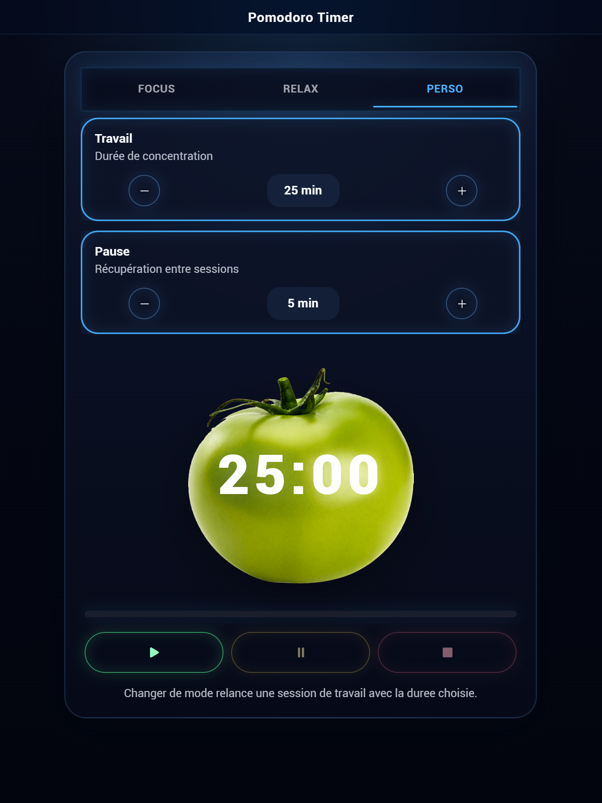

# Pomodoro Timer

Un timer Pomodoro simple et élégant avec une tomate stylisée en CSS. Ce projet utilise Ionic et Angular pour créer une interface utilisateur attrayante et fonctionnelle.

## Logo

<div style="text-align: center;">
  
</div>

## Capture



## Fonctionnalités

- **Timer Pomodoro** : Suivez vos sessions de travail et de pause avec un timer visuel.
- **Configuration Personnalisée** : Ajustez la durée des sessions de travail et de pause selon vos besoins.
- **Design Réaliste** : Une tomate stylisée avec des feuilles pour un look attrayant et réaliste.

## Installation

1. **Clonez le dépôt** :

   ```bash
   git clone https://github.com/votre-utilisateur/pomodoro-timer.git
   cd pomodoro-timer
   ```

2. Installez les dépendances :

   ```bash
   npm install
   ```

3. Installer Capacitor :

   ```bash
   npm install @capacitor/core @capacitor/cli
   npx cap init
   npx cap add native-audio
   npx cap sync
   ```

4. Lancez l'application :

   ```bash
   ionic serve
   ```

## Utilisation

- Démarrer/Arrêter le Timer : Utilisez les boutons pour démarrer, mettre en pause ou arrêter le timer.
- Configurer les Durées : Ajustez les durées de travail et de pause à l'aide des boutons + et -.

## Technologies Utilisées

- Ionic : Pour la création de l'interface utilisateur mobile et web.
- Angular : Pour la structure et la logique de l'application.
- Capacitor : Pour les fonctionnalités natives, y compris les notifications sonores.
- CSS : Pour le design.

## Contribution

Les contributions sont les bienvenues ! 

- Fork le projet.
- Créez une branche pour votre fonctionnalité (git checkout -b feature/nouvelle-fonctionnalite).
- Committez vos modifications (git commit -am 'Ajout d'une nouvelle fonctionnalité').
- Poussez vers la branche (git push origin feature/nouvelle-fonctionnalite).
- Créez une Pull Request.

## Licence

Ce projet est sous licence MIT. Voir le fichier LICENSE pour plus de détails.

Merci d'utiliser le Pomodoro Timer ! Si vous avez des questions ou des suggestions, n'hésitez pas à ouvrir une issue ou à contacter le mainteneur du projet.
